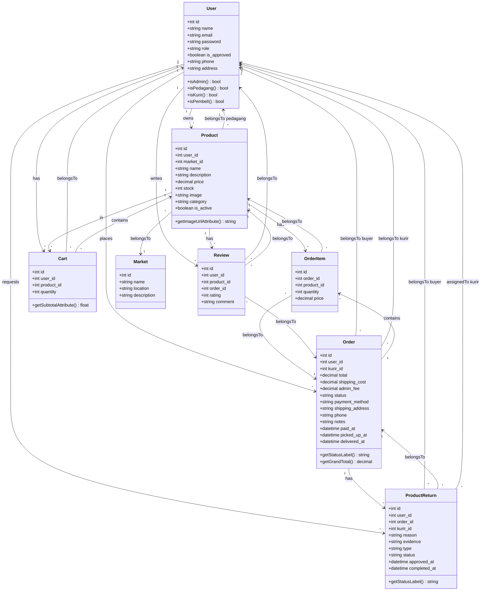

# Dokumentasi UML - Peukan Rumoh
## Sistem E-Commerce Multi-Role

---

## 1. Use Case Diagram

```mermaid
graph TB
    subgraph Actors
        Admin["🔧 Admin"]
        Pedagang["🏪 Pedagang"]
        Kurir["🚚 Kurir"]
        Pembeli["🛒 Pembeli"]
        Guest["👤 Guest"]
    end
    
    subgraph "Use Cases"
        subgraph "Autentikasi"
            UC1["Login"]
            UC2["Register"]
            UC3["Logout"]
            UC4["Edit Profil"]
        end
        
        subgraph "Admin"
            UC5["Kelola Users"]
            UC6["Approve User"]
            UC7["Lihat Dashboard"]
            UC8["Kelola Returns"]
        end
        
        subgraph "Pedagang"
            UC9["Kelola Produk"]
            UC10["Lihat Pesanan Masuk"]
            UC11["Proses Pesanan"]
            UC12["Lihat Statistik"]
            UC13["Handle Return"]
        end
        
        subgraph "Kurir"
            UC14["Terima Pengiriman"]
            UC15["Update Status Pengiriman"]
            UC16["Konfirmasi Pengiriman"]
            UC17["Handle Return Pickup"]
        end
        
        subgraph "Pembeli"
            UC18["Lihat Produk"]
            UC19["Tambah ke Keranjang"]
            UC20["Checkout"]
            UC21["Bayar Pesanan"]
            UC22["Lihat Riwayat Pesanan"]
            UC23["Beri Review"]
            UC24["Ajukan Return"]
        end
    end
    
    Guest --> UC1
    Guest --> UC2
    Guest --> UC18
    
    Admin --> UC1
    Admin --> UC5
    Admin --> UC6
    Admin --> UC7
    Admin --> UC8
    Admin --> UC3
    Admin --> UC4
    
    Pedagang --> UC1
    Pedagang --> UC9
    Pedagang --> UC10
    Pedagang --> UC11
    Pedagang --> UC12
    Pedagang --> UC13
    Pedagang --> UC3
    Pedagang --> UC4
    
    Kurir --> UC1
    Kurir --> UC14
    Kurir --> UC15
    Kurir --> UC16
    Kurir --> UC17
    Kurir --> UC3
    Kurir --> UC4
    
    Pembeli --> UC1
    Pembeli --> UC18
    Pembeli --> UC19
    Pembeli --> UC20
    Pembeli --> UC21
    Pembeli --> UC22
    Pembeli --> UC23
    Pembeli --> UC24
    Pembeli --> UC3
    Pembeli --> UC4
```

---

## 2. Skenario Use Case

### UC-01: Login
| Item | Deskripsi |
|------|-----------|
| **Aktor** | Admin, Pedagang, Kurir, Pembeli |
| **Deskripsi** | User melakukan autentikasi ke sistem |
| **Precondition** | User memiliki akun terdaftar dan disetujui |
| **Main Flow** | 1. User membuka halaman login 2. User memasukkan email dan password 3. Sistem memvalidasi kredensial 4. Sistem redirect ke dashboard sesuai role |
| **Alternative** | 3a. Kredensial salah → tampilkan error 3b. Akun belum disetujui → tampilkan pesan menunggu |
| **Postcondition** | User berhasil login dan masuk ke dashboard |

---

### UC-09: Kelola Produk
| Item | Deskripsi |
|------|-----------|
| **Aktor** | Pedagang |
| **Deskripsi** | Pedagang mengelola produk miliknya |
| **Precondition** | Pedagang sudah login dan disetujui |
| **Main Flow** | 1. Pedagang membuka menu "Produk Saya" 2. Sistem menampilkan daftar produk 3. Pedagang dapat tambah/edit/hapus produk 4. Sistem menyimpan perubahan |
| **Alternative** | 3a. Validasi gagal → tampilkan error |
| **Postcondition** | Data produk tersimpan di database |

---

### UC-20: Checkout
| Item | Deskripsi |
|------|-----------|
| **Aktor** | Pembeli |
| **Deskripsi** | Pembeli melakukan checkout dari keranjang |
| **Precondition** | Keranjang tidak kosong, user sudah login |
| **Main Flow** | 1. Pembeli klik checkout 2. Sistem menampilkan ringkasan pesanan 3. Pembeli mengisi alamat pengiriman 4. Pembeli pilih metode pembayaran 5. Sistem membuat order baru 6. Keranjang dikosongkan |
| **Alternative** | 4a. Stok tidak cukup → tampilkan error |
| **Postcondition** | Order terbuat dengan status "pending" |

---

### UC-15: Update Status Pengiriman
| Item | Deskripsi |
|------|-----------|
| **Aktor** | Kurir |
| **Deskripsi** | Kurir mengupdate status pengiriman |
| **Precondition** | Kurir sudah ambil pesanan |
| **Main Flow** | 1. Kurir membuka daftar pengiriman 2. Kurir pilih order yang akan diupdate 3. Kurir klik "Selesaikan Pengiriman" 4. Sistem update status order ke "completed" |
| **Postcondition** | Order status menjadi "completed" |

---

### UC-24: Ajukan Return
| Item | Deskripsi |
|------|-----------|
| **Aktor** | Pembeli |
| **Deskripsi** | Pembeli mengajukan pengembalian barang |
| **Precondition** | Order sudah diterima (completed) |
| **Main Flow** | 1. Pembeli buka riwayat pesanan 2. Pembeli pilih order dan klik "Ajukan Return" 3. Pembeli isi alasan dan upload bukti 4. Pembeli pilih tipe (refund/replacement) 5. Sistem buat return request |
| **Alternative** | 3a. Bukti tidak valid → tampilkan error |
| **Postcondition** | Return request terbuat dengan status "pending" |

---

## 3. Activity Diagram

### Proses Pembelian (Checkout Flow)

---

### Proses Return Barang

---

## 4. Class Diagram

---

## 5. Sequence Diagram

### Proses Checkout

---

### Proses Pengiriman oleh Kurir

---

### Proses Return Barang

---

## 6. Status Flow Diagram

### Order Status

### Return Status

---

## Ringkasan Entitas

| Entitas | Deskripsi | Relasi Utama |
|---------|-----------|--------------|
| **User** | Pengguna sistem (Admin/Pedagang/Kurir/Pembeli) | Has many: Products, Orders, Carts |
| **Product** | Barang yang dijual pedagang | Belongs to: User, Market |
| **Order** | Pesanan dari pembeli | Has many: OrderItems |
| **OrderItem** | Detail item dalam pesanan | Belongs to: Order, Product |
| **Cart** | Keranjang belanja pembeli | Belongs to: User, Product |
| **Review** | Ulasan produk | Belongs to: User, Product, Order |
| **Market** | Data pasar tradisional | Has many: Products |
| **ProductReturn** | Permintaan pengembalian | Belongs to: User, Order |
